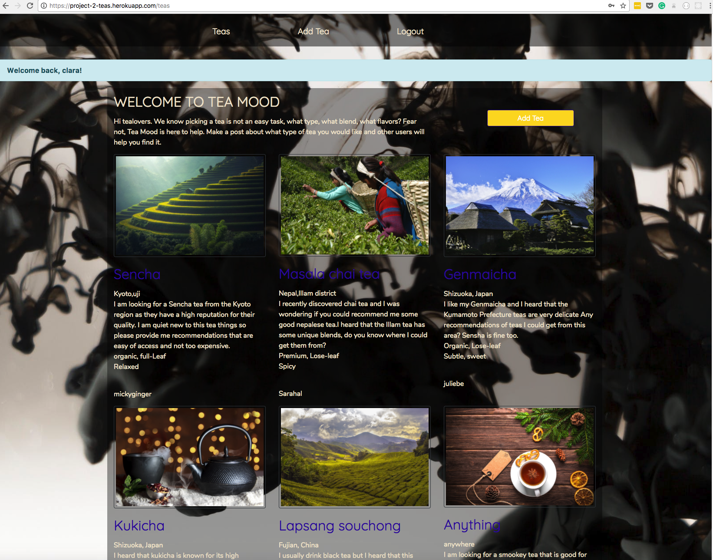
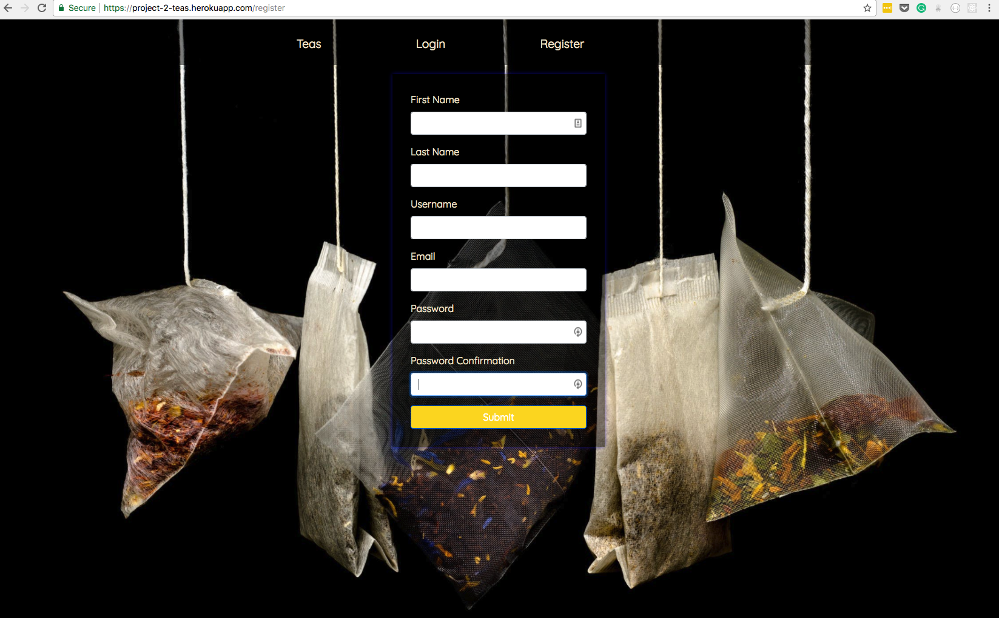

# WDI PROJECT 2

## GA WDI30 Project 2: 'Tea App?'

For my second project, I decided to create an App that helps user finds new type of teas to their liking based on recommendations from other tea lovers. Users can log in and register as well as create new posts or leave coments on other users post. 

## Why this project?

I wanted this project to be the answer to a problem many people have. Reading documentations about teas is sometimes not enough and it is really useful to have the imput of someone else. it was done usisng EJS, HTML5, CSS3 and Bootstrap.

## Libraries /Setup/ external stylesheets used

bcrypt
Bluebird
Browser-sync
ejs
Express
Forever
Method-override
Mongoose
Morgan
Babel
nodemon
Bootstrap

App link: [https://project-2-teas.herokuapp.com/register ]()

## Challenges:

I had a hard time with comments and using the bootstrap grids so that everything falls in place. It was difficult to switch from jquery to EJS as the logic behind is slightly different.

## strenght:

I believe that the strenght of this this project is the styling as it looks coherent from one page to another. I also reached to make it personal rather than looking like I used bootstrap. The authentication did not pose too many problems as well.

## for the future:

* There are a few styling element I could improve such as the website responsiveness.
* Create a user page would be great as well so that the user can see his post and the one he commented quickly
* I would also like to add an API that can redirect users to tea websites based on the suggestions they got
* It would also be nice to add a rating system so that the users can know if a post is usefull
* Finally i would like to add a filter so that users can search quickly for a post that looks like their inquiry to avoid two posts for the same tea search. 
